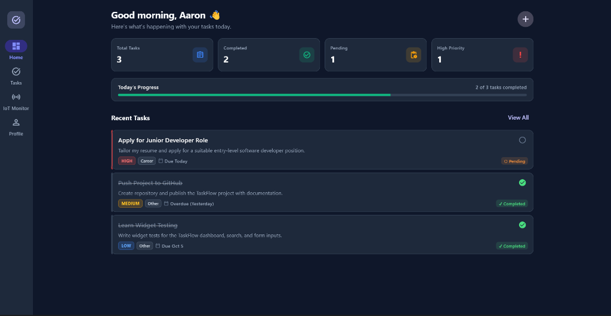
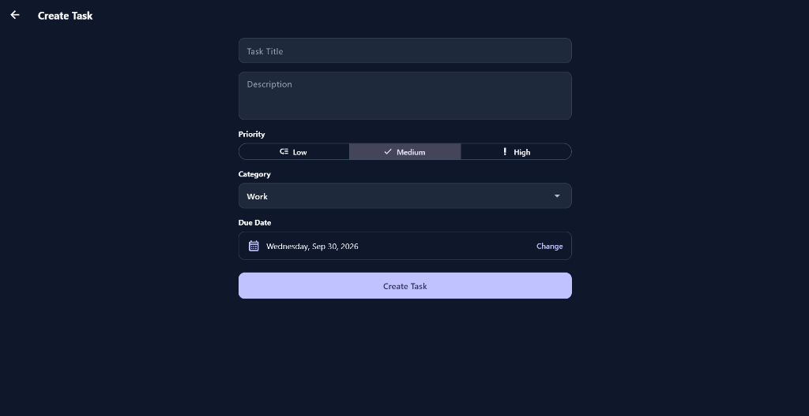
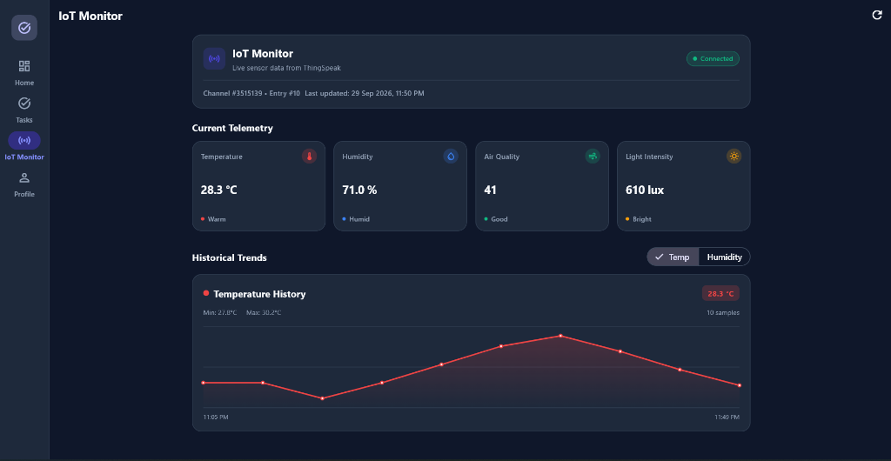
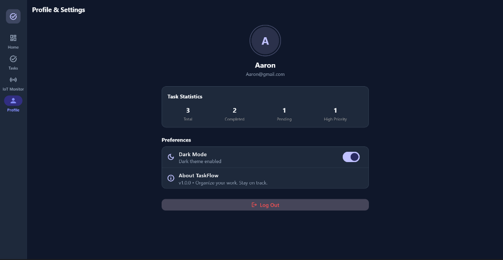

# TaskFlow — Modern Task & Workflow Management App with IoT Monitoring

TaskFlow is a production-quality, responsive task and workflow management application built with **Flutter** and **Provider**, featuring real-time **ThingSpeak IoT environmental monitoring**. Designed with a clean layered architecture, Material 3 design system, and offline-first capabilities, TaskFlow showcases robust state management, REST API integration, local persistence, responsive navigation, and comprehensive automated test coverage.

---

## 📸 Screenshots & UI Preview

| Dashboard & Overview | Task Creation & Scheduling |
|:---:|:---:|
|  |  |
| **Personalized Dashboard:** Time-of-day greeting, key statistics cards, daily progress tracking bar, and recent task list. | **Task Creation Form:** Title, description, segmented priority selector (Low / Medium / High), category dropdown, and date picker. |

| Live IoT Environmental Telemetry | Profile & Settings |
|:---:|:---:|
|  |  |
| **IoT Telemetry Screen:** Live readings from ThingSpeak (Temperature, Humidity, Air Quality, Light Intensity) and interactive historical trend chart. | **Profile & Preferences:** User details, aggregated task statistics, one-tap dark/light mode toggle, and app details. |

---

## 🔄 Application Workflow

TaskFlow provides an intuitive, end-to-end user flow connecting personal productivity with real-time workplace environmental awareness.

```
┌─────────────────┐       ┌────────────────────────┐       ┌──────────────────────┐
│  Authentication │ ────> │  Dashboard & Overview  │ ────> │  Task CRUD Workflow  │
│  & Splash Boot  │       │  (Metrics & Progress)  │       │ (Create, Edit, Done) │
└─────────────────┘       └───────────┬────────────┘       └──────────────────────┘
                                      │
                                      ├──────────────────> ┌──────────────────────┐
                                      │                    │  IoT Live Telemetry  │
                                      │                    │  (Sensors & Trends)  │
                                      │                    └──────────────────────┘
                                      │
                                      └──────────────────> ┌──────────────────────┐
                                                           │  Profile & Settings  │
                                                           │  (Dark Mode Toggle)  │
                                                           └──────────────────────┘
```

### 1. Authentication & Session Initialization
- **Cold Boot & Splash:** The app starts with a splash screen that checks `SharedPreferences` for cached session tokens and theme preferences.
- **Login / Onboarding:** Unauthenticated users are routed to a clean, validated authentication screen with email and password checks.

### 2. Dashboard & Performance Tracking
- **Personalized Header:** Welcomes the user dynamically based on the current system time (*Good morning*, *Good afternoon*, *Good evening*).
- **KPI Metrics:** Immediate visibility into **Total Tasks**, **Completed**, **Pending**, and **High Priority** items with zero layout-shift cards.
- **Daily Progress Bar:** A visual progress bar calculating completion percentage in real time (`completed / total * 100%`).
- **Urgent Action Items:** Displays recent tasks with priority badges and due date alerts, allowing quick navigation to pending tasks.

### 3. Task Management & Lifecycle (CRUD)
- **Create:** Click the `+` action to open the task form. Users input task details, select priority (`Low`, `Medium`, `High`), choose a category (`Work`, `Career`, `Learning`, `Personal`, `Shopping`, `Other`), and pick a due date.
- **Search & Multi-Axis Filter:** Search tasks by title or description, or filter by completion status, priority, and category chips.
- **Toggle & Edit:** Mark tasks as complete or pending with a single tap. Form fields pre-populate for frictionless editing with optimistic UI updates.
- **Safe Delete:** Protects against accidental deletion via an alert confirmation dialog.

### 4. Real-Time IoT Environmental Monitoring
- **Live Telemetry Retrieval:** Connects to ThingSpeak Channel **#3515139** using non-blocking asynchronous REST requests with pull-to-refresh and auto-refresh on screen load.
- **Condition Status Cards:** Translates raw sensor values into meaningful health and comfort indicators:
  - **Temperature (`field1`):** Celsius readout with comfort classifications (*Optimal*, *Warm*, *Cool*).
  - **Humidity (`field2`):** Percentage with ambient moisture assessment (*Comfortable*, *Humid*, *Dry*).
  - **Air Quality (`field3`):** Gas/particulate index evaluated into ratings (*Good*, *Moderate*, *Poor*).
  - **Light Intensity (`field4`):** Ambient illumination lux level (*Bright*, *Adequate*, *Low*).
- **Historical Analysis:** A zero-dependency `CustomPainter` line chart visualizes historical trends over time with smooth gradient fills and dynamic scale bounds.

### 5. Personalization & Responsive Experience
- **Theme Switching:** Instant toggle between Material 3 Light Mode and Dark Mode, persisted across application restarts.
- **Adaptive Layout:** Adapts automatically between mobile bottom navigation bar (`width < 720px`) and desktop/tablet navigation rail (`width >= 720px`).

---

## 🌟 Key Features

### 📋 Task & Workflow Management
- **Dynamic Analytics Dashboard:**
  - Personalized time-of-day greeting (*"Good morning"*, *"Good afternoon"*, *"Good evening"*).
  - Compact, responsive statistics cards (Total Tasks, Completed, Pending, High Priority) with fixed vertical extent to prevent layout shift.
  - Real-time **"Today's Progress"** completion bar with dynamic percentages and task counters.
  - Quick-access recent tasks list with direct navigation to the task catalog.

- **Full Task Lifecycle (CRUD):**
  - **Create Task:** Intuitive form supporting title, description, priority segmented control (Low, Medium, High), task category dropdown, and interactive due date picker. Loading states prevent accidental double-submission.
  - **Task Details:** Comprehensive view featuring priority badges, category chips, formatted due dates, inline completion toggling, edit shortcuts, and a destructive delete confirmation dialog.
  - **Edit Task:** Pre-fills all task attributes seamlessly with optimistic state synchronization and clear user feedback via SnackBars.
  - **Delete Task:** Safety confirmation dialog (`Delete Task?`) protecting against accidental deletions.

- **Advanced Search & Multi-Axis Filtering:**
  - Full-text search matching across task titles, descriptions, and category labels simultaneously.
  - Status & Priority filter chips (*All*, *Pending*, *Completed*, *High Priority*).
  - Horizontally scrollable **Category filter chips** (*Work*, *Career*, *Learning*, *Personal*, *Shopping*, *Other*).
  - Empty state illustrations with contextual action buttons when filters match zero tasks.

### 🌐 Live ThingSpeak IoT Environmental Monitoring
- **Real-Time Telemetry Dashboard:**
  - Live feeds from ThingSpeak Channel **#3515139** with auto-refresh on navigation and manual pull-to-refresh.
  - Formatted "Last updated" relative timestamp display and live connection health status pill.
- **Metric Cards with Status Indicators:**
  - **Temperature (`field1`):** Celsius display with comfort index evaluation (*Optimal*, *Warm*, *Cool*).
  - **Humidity (`field2`):** Percentage display with humidity status assessment (*Comfortable*, *Humid*, *Dry*).
  - **Air Quality (`field3`):** Numerical index with indoor air quality rating (*Good*, *Moderate*, *Poor*).
  - **Light Intensity (`field4`):** Lux rating with ambient illumination assessment (*Bright*, *Adequate*, *Low*).
- **Interactive Historical Trend Charts:**
  - Custom-engineered, zero-dependency `CustomPainter` line chart with gradient fill, dynamic min/max bounds, grid references, and time axis labels.
  - Filter chips allowing instantaneous switching between Temperature, Humidity, Air Quality, and Light historical feeds.
- **Resilient Network Handling:**
  - Loading skeleton indicators during telemetry retrieval.
  - Dedicated error states with user-friendly diagnostics and a one-tap **Retry** action.
  - Empty state fallback for channels with no recorded feeds.

### 📱 Platform & UX
- **Responsive Multi-Platform Navigation:**
  - **Desktop & Tablet (width ≥ 720px):** Permanent `NavigationRail` with customized brand header, labeled destinations, and quick logout actions.
  - **Mobile (width < 720px):** Material 3 bottom `NavigationBar` optimized for thumb-reach and one-handed mobile workflows.
  - Tested across standard desktop (1920x1080, 1440x900), tablet (1024x768, 768x1024), and mobile viewports (390x844).
- **Theming & Personalization:**
  - Full Light and Dark theme support with contrast-optimized Material 3 palettes.
  - Profile screen with user information, activity metrics, and one-tap theme switching.
- **Offline-First Resilience & REST Integration:**
  - Network-first with local cache fallback powered by `SharedPreferences`.
  - Fallback seed dataset ensures the application remains functional even in airplane mode or when backend services are unreachable.

---

## 📡 ThingSpeak IoT Integration

### Sensor Field Mapping

| Field | Metric | Unit | Representation | Typical Range |
|---|---|---|---|---|
| `field1` | **Temperature** | °C | Ambient room / environmental temperature | -10 °C to 50 °C |
| `field2` | **Humidity** | % | Relative humidity percentage | 0% to 100% |
| `field3` | **Air Quality** | Index | Gas / particulate air pollution index | 0 to 500 |
| `field4` | **Light Intensity** | lux | Ambient light illumination level | 0 to 2000+ lux |

### Endpoints Utilized
- **Latest Reading:** `GET https://api.thingspeak.com/channels/{channel_id}/feeds/last.json`
- **Historical Feeds:** `GET https://api.thingspeak.com/channels/{channel_id}/feeds.json?results=20`

### 🔒 Security Best Practices
- **No Hardcoded API Keys:** API keys and Channel IDs are strictly passed at compile or launch time via `--dart-define`.
- **Private Channel Header:** Authenticates requests using the `THINGSPEAKAPIKEY` HTTP header.
- **Credential Protection:** Keys are never stored in source code, committed to Git repositories, printed in debug logs, or exposed in client exception messages.

---

## 🏗️ Architecture & Project Structure

TaskFlow follows a clean, decoupled layered architecture separating concerns across presentation, state management, and data access.

```
lib/
├── config/
│   └── thingspeak_config.dart   # ThingSpeak channel configuration & safe environment reader
├── main.dart                    # Application entry point & MultiProvider registration
├── models/
│   ├── iot_reading.dart         # Safe-parsing IoT sensor data model & metric mappers
│   ├── task.dart                # Task model, TaskPriority, TaskCategory enums & serialization
│   └── user.dart                # User model & authentication token state
├── providers/
│   ├── auth_provider.dart       # Authentication session & user state management
│   ├── iot_provider.dart        # IoT telemetry state, history cache & fetch orchestration
│   ├── task_provider.dart       # Task business logic, filtering, search & metrics calculation
│   └── theme_provider.dart      # Light/Dark mode state and persistence
├── screens/
│   ├── dashboard_screen.dart    # Analytics dashboard, compact stat cards & progress bar
│   ├── iot_monitor_screen.dart  # Live IoT sensor telemetry, trend charts & retry flow
│   ├── login_screen.dart        # Authentication screen with field validation
│   ├── main_navigation.dart     # Responsive shell (NavigationRail / NavigationBar)
│   ├── profile_screen.dart      # User profile, theme toggle & app version info
│   ├── splash_screen.dart       # Cold-start loading and auth status check
│   ├── task_details_screen.dart # Task details view, delete dialog & status toggles
│   ├── task_form_screen.dart    # Reusable Create/Edit task form with validation
│   └── task_list_screen.dart    # Searchable and filterable task collection
├── services/
│   ├── auth_service.dart        # Authentication API client & credentials validation
│   ├── storage_service.dart     # SharedPreferences local cache manager
│   ├── task_service.dart        # REST API service for task CRUD with demo fallback
│   └── thingspeak_service.dart  # ThingSpeak REST client, header injection & exception mapping
├── utils/
│   ├── date_formatter.dart      # Human-readable date formatting utilities
│   └── validators.dart          # Form input validators (email, password, required fields)
└── widgets/
    ├── priority_badge.dart      # Color-coded priority chip (Low, Medium, High)
    ├── sensor_chart.dart        # CustomPainter responsive line chart with gradient fill
    └── task_card.dart           # Reusable task list card with status and category chips
```

### Data Flow & Architecture Diagram

```
┌────────────────────────────────────────────────────────────────────────┐
│                          UI / Screens Layer                            │
│ (Dashboard, TaskList, TaskDetails, TaskForm, IoTMonitor, Profile)      │
└───────────────────────────────────┬────────────────────────────────────┘
                                    │ Watches & Dispatches Actions
┌───────────────────────────────────▼────────────────────────────────────┐
│                       Provider State Management                        │
│          (TaskProvider, IoTProvider, AuthProvider, ThemeProvider)      │
└─────────────┬─────────────────────┬──────────────────────┬─────────────┘
              │ Calls               │ Calls                │ Persists
┌─────────────▼─────────────┐ ┌─────▼────────────────────┐ ┌▼────────────┐
│    Task REST Service      │ │  ThingSpeak REST Service │ │ Local Cache │
│ (TaskService, AuthService)│ │   (ThingSpeakService)    │ │(Preferences)│
└─────────────┬─────────────┘ └─────┬────────────────────┘ └─────────────┘
              │                     │
              │ HTTP GET/POST       │ HTTP GET (with THINGSPEAKAPIKEY header)
              ▼                     ▼
┌───────────────────────────┐ ┌──────────────────────────────────────────┐
│  TaskFlow API / Seed API  │ │  ThingSpeak API (https://api.thingspeak) │
└───────────────────────────┘ └──────────────────────────────────────────┘
```

---

## 🛠️ Tech Stack & Dependencies

- **Language:** Dart 3.x
- **Framework:** Flutter 3.x (Material 3)
- **State Management:** [`provider`](https://pub.dev/packages/provider) (`ChangeNotifierProvider`, `Consumer`)
- **Local Persistence:** [`shared_preferences`](https://pub.dev/packages/shared_preferences)
- **Networking:** [`http`](https://pub.dev/packages/http)
- **Date Formatting:** [`intl`](https://pub.dev/packages/intl)
- **Visuals & Charts:** Native Flutter `CustomPainter` (zero extra dependencies)
- **Testing:** `flutter_test` (Unit and Widget testing suite)

---

## 🚀 Getting Started

### Prerequisites

- Flutter SDK (v3.19.0 or higher recommended)
- Dart SDK (v3.3.0 or higher)
- Android Studio / VS Code / Google Antigravity
- An active device, emulator, or desktop browser / window

### Installation & Run

1. Clone or navigate to the repository directory:
   ```bash
   git clone https://github.com/aaronmohan/TaskFlow.git
   cd TaskFlow
   ```

2. Install dependencies:
   ```bash
   flutter pub get
   ```

3. Run the application with ThingSpeak credentials:
   ```bash
   flutter run \
     --dart-define=THINGSPEAK_CHANNEL_ID=3515139 \
     --dart-define=THINGSPEAK_READ_API_KEY=YOUR_READ_API_KEY
   ```

   *Note: On Windows PowerShell:*
   ```powershell
   flutter run --dart-define=THINGSPEAK_CHANNEL_ID=3515139 --dart-define=THINGSPEAK_READ_API_KEY=YOUR_READ_API_KEY
   ```

---

## 🧪 Testing & Code Quality

The project includes thorough unit tests for business logic, data models, validators, and service exception handling, along with widget tests for responsive UI screens and interactions.

### Run Static Analysis
Ensure zero lint or analyzer warnings:
```bash
flutter analyze
```
*Result: 0 issues found!*

### Run Automated Tests
Execute the complete test suite (75 automated tests across all models, providers, services, validators, and responsive widget screens):
```bash
flutter test
```
*Result: All 75 tests passed!*

---

## 📋 Test Coverage Summary

- **Unit Tests:**
  - `iot_reading_test.dart`: Parsing valid feeds, ISO 8601 timestamps, string and numeric coercion, null & NaN fallback, serialization to/from JSON, UTC to local timezone validation, and sensor status thresholds for Temperature, Humidity, Air Quality, and Light Intensity.
  - `thingspeak_service_test.dart`: Successful HTTP responses, header verification (`THINGSPEAKAPIKEY`), error status handling (401/403, 404, 429, 500, "-1" auth code, socket timeout) without credential leakage.
  - `iot_provider_test.dart`: Initial state, successful reading and history cache updates, chronological sorting, exception propagation, duplicate request suppression, error resetting.
  - `task_model_test.dart`: Complete JSON serialization/deserialization, null handling, category parsing, and fallback behavior.
  - `task_provider_test.dart`: Statistics calculation, priority filtering, category filtering, search queries, and task CRUD operations.
  - `validators_test.dart`: Input validation rules for emails, passwords, and required fields.
- **Widget Tests:**
  - `sensor_chart_test.dart`: Device local timezone axis rendering (`toLocal()`), chronological sorting of historical feeds, multi-sample datasets (8-20 readings), null and NaN skipping, single reading layout, and empty state fallback.
  - `iot_monitor_screen_test.dart`: Live sensor cards rendering (Temperature, Humidity, Air Quality, Light Intensity), status captions (Warm, Humid, Good, Bright), connection pill, chart view, error state display, and tap-to-retry mechanism.
  - `create_task_test.dart`: Form validation when creating tasks.
  - `edit_task_test.dart`: Pre-filling data, saving changes, and SnackBar feedback.
  - `task_details_test.dart`: Viewing full task metadata, status toggling, and delete confirmation dialog flow.
  - `dashboard_polish_test.dart`: Compact statistics cards, progress indicators, recent tasks, and responsive layout across desktop, tablet, and mobile resolutions (1920x1080, 1440x900, 1024x768, 768x1024, 390x844).
  - `login_screen_test.dart`: Form validation, TaskFlow branding, and submit handlers.
  - `task_card_test.dart`: Priority badges, status indicators, and completion chips.
  - `widget_test.dart`: Application cold boot and splash branding smoke test.
